This file compares palette ideas for displaying rurality measures, using
the [Index of Relative Rurality
(IRR)](https://purr.purdue.edu/publications/2960/1).

Ten Category Palettes
=====================

### Viridis/Website Palette

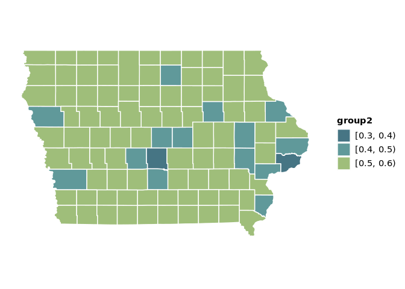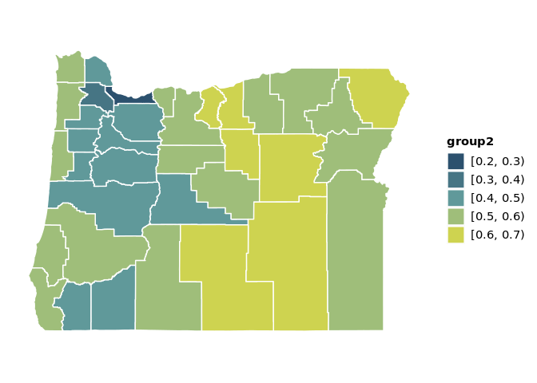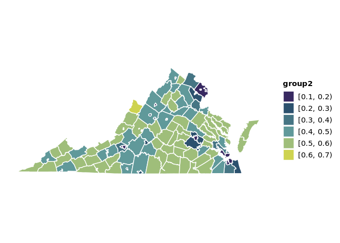

### Viridis Plasma

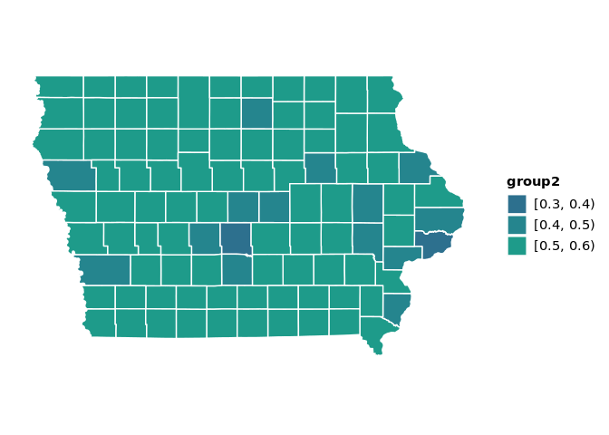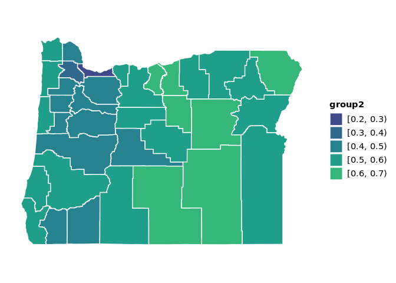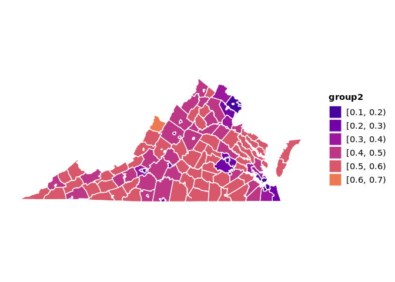

### Viridis

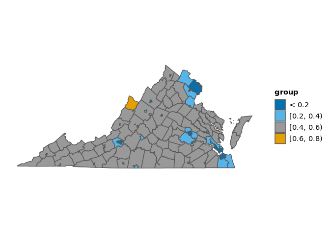

Five Category Palettes
======================

### Color Blind Palette

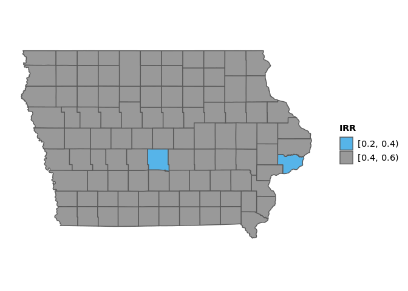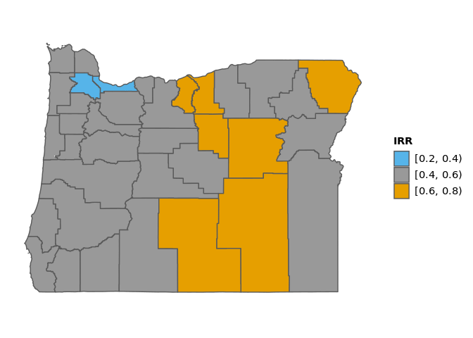

### Evo Palette

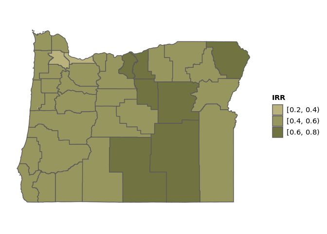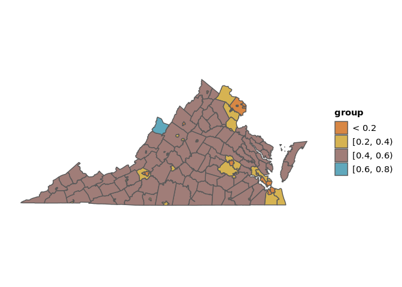

### Evo Palette 2

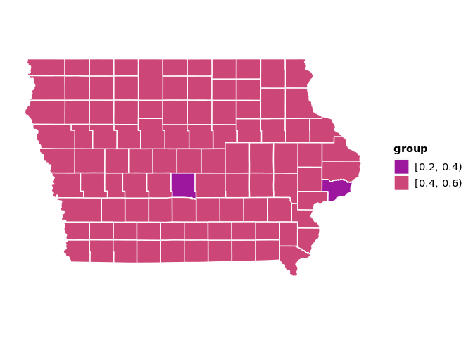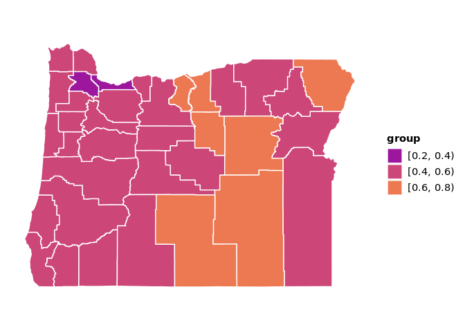

### Viridis Plasma

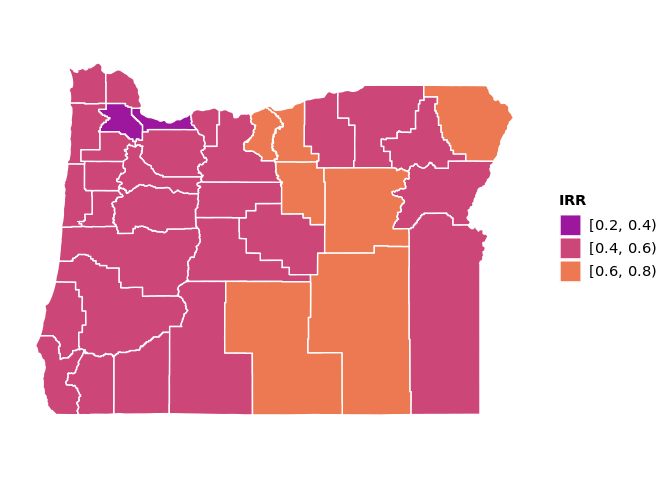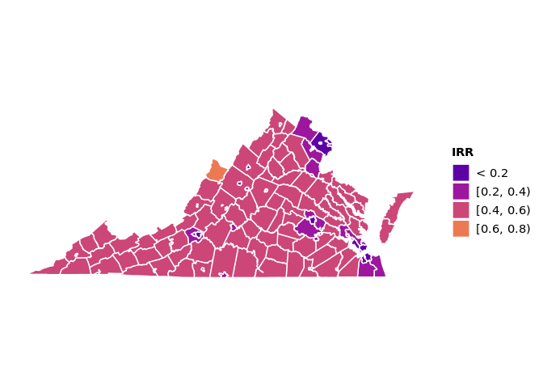

### Viridis

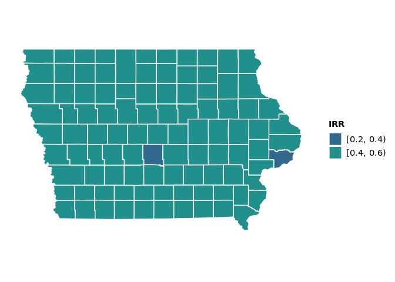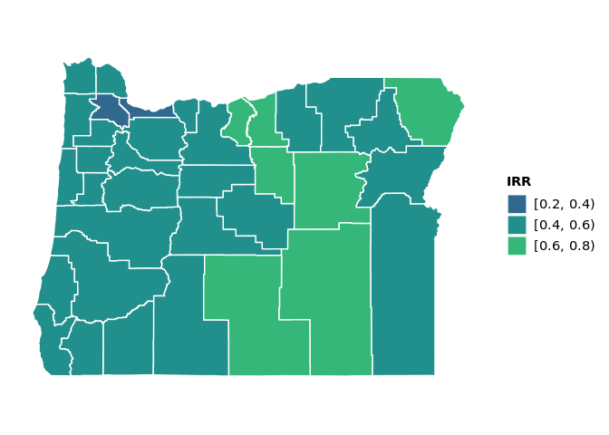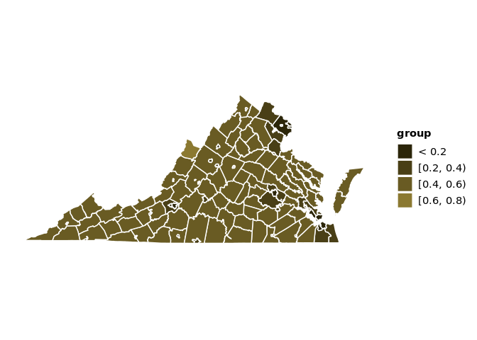

### Color Picker

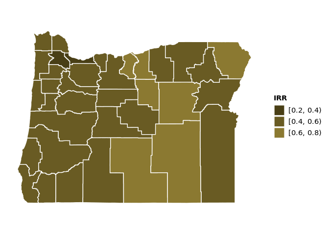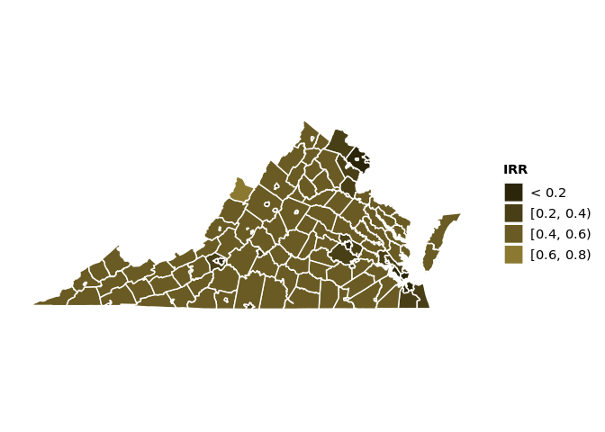

### Coolors 1

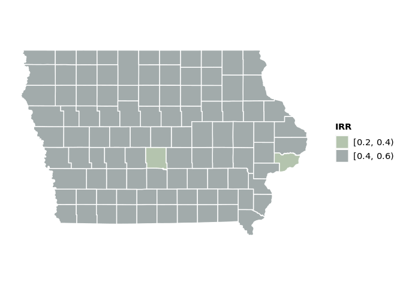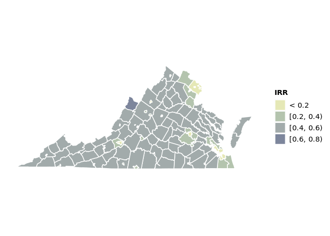

### Coolors 2

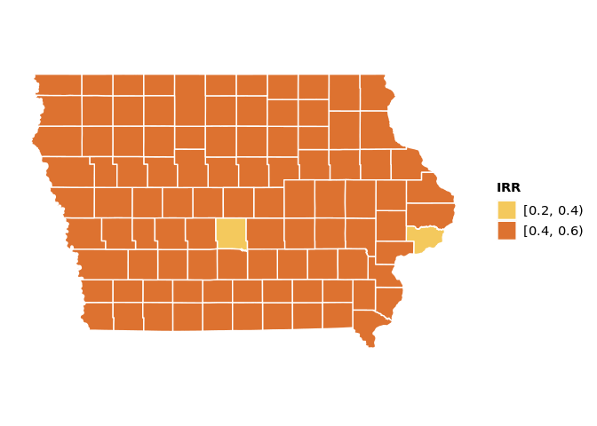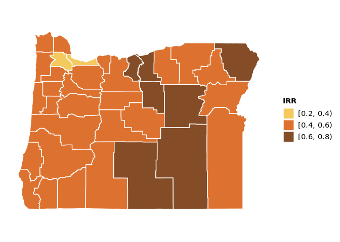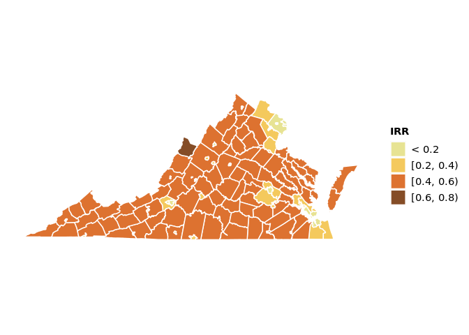
