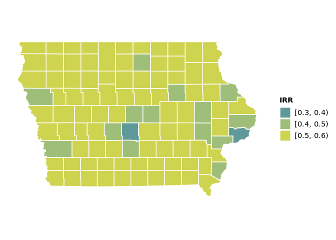
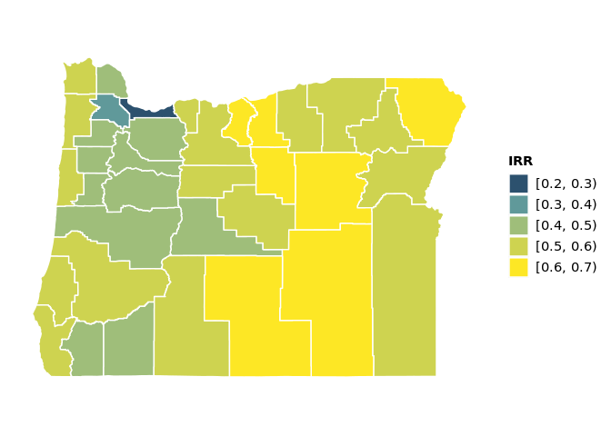
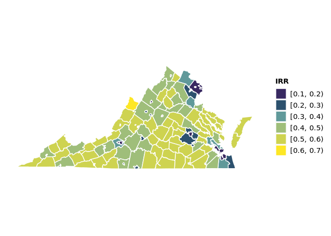
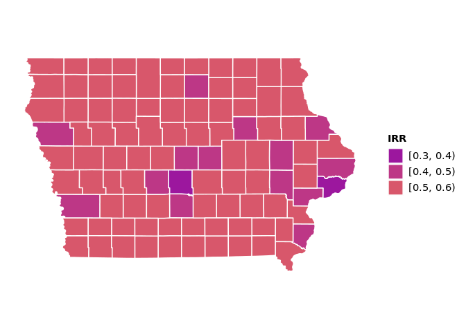
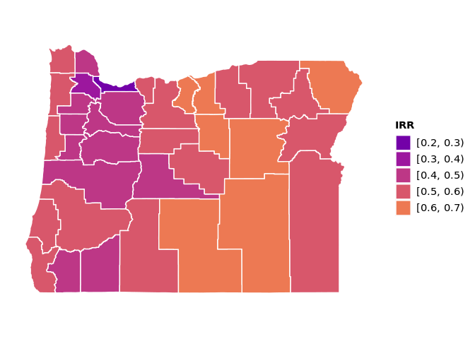
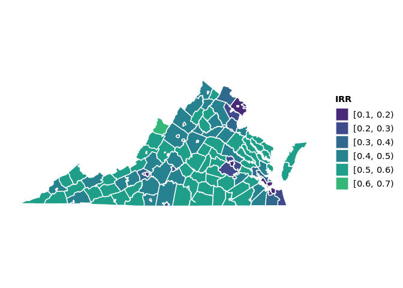
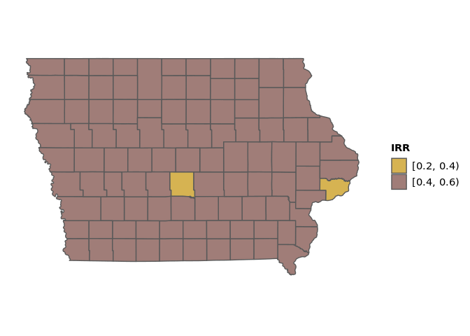
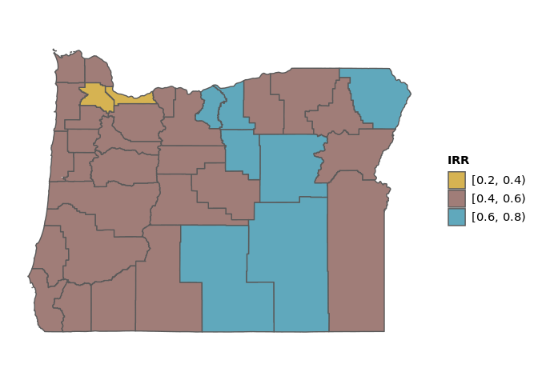
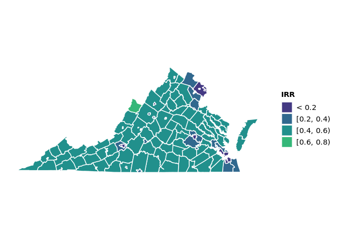

This file compares palette ideas for displaying rurality measures, using
the [Index of Relative Rurality
(IRR)](https://purr.purdue.edu/publications/2960/1).

Ten Category Palettes
=====================

### Viridis/Website Palette

### Viridis Plasma

### Viridis

Five Category Palettes
======================

### Color Blind Palette

### Evo Palette

### Evo Palette 2

### Viridis Plasma

### Viridis

### Color Picker

### Coolors 1

### Coolors 2

