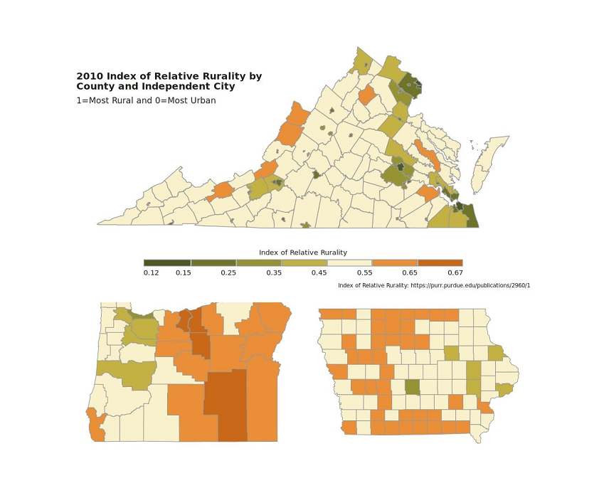
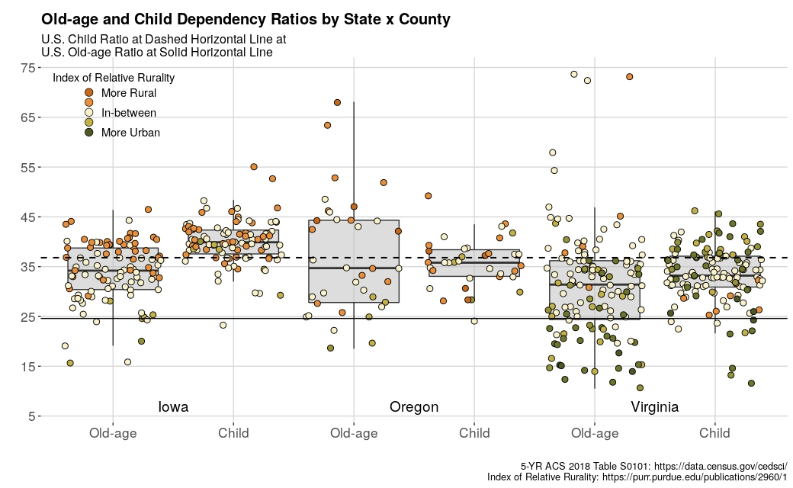
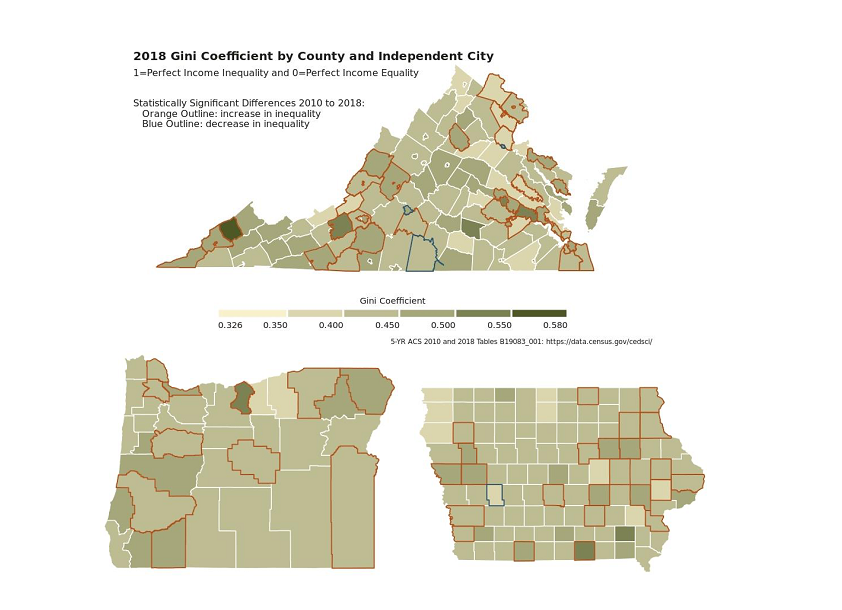
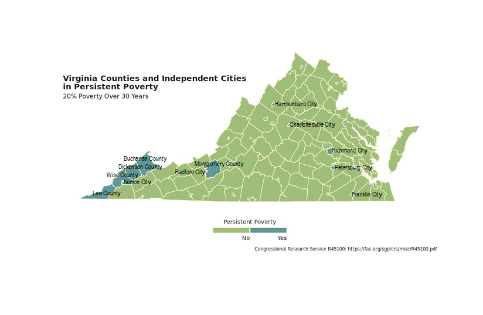
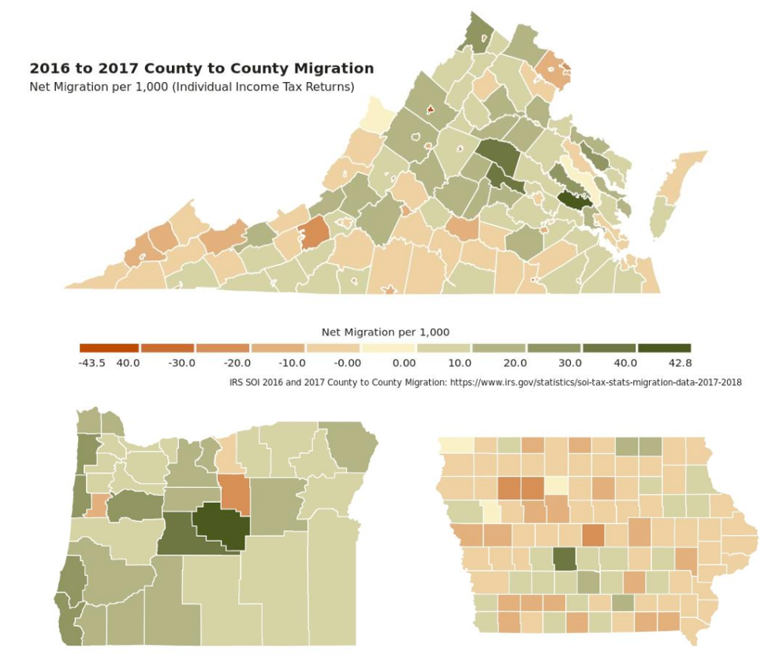
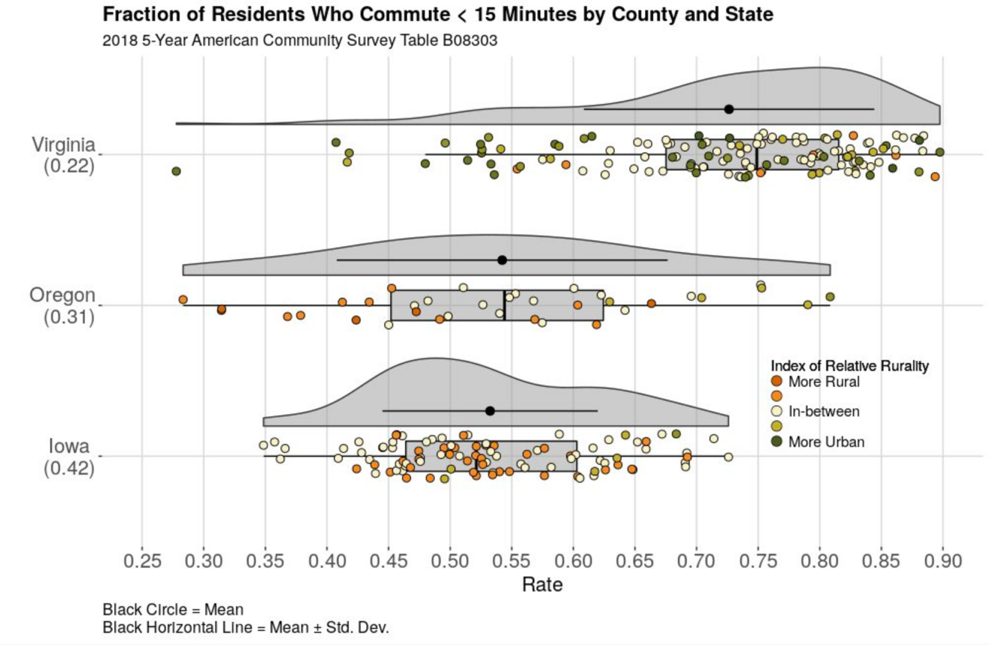
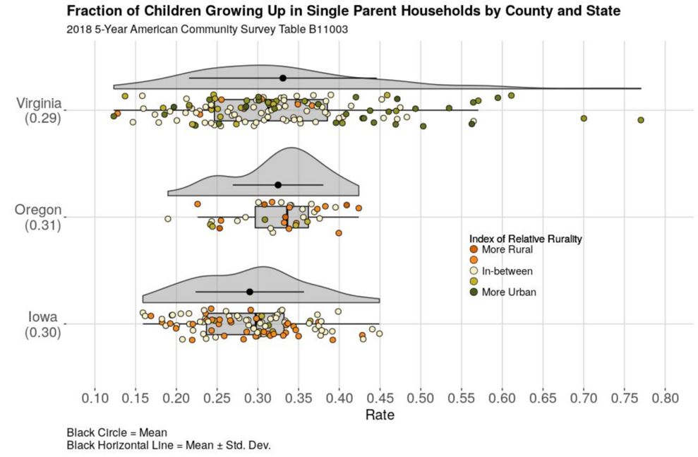
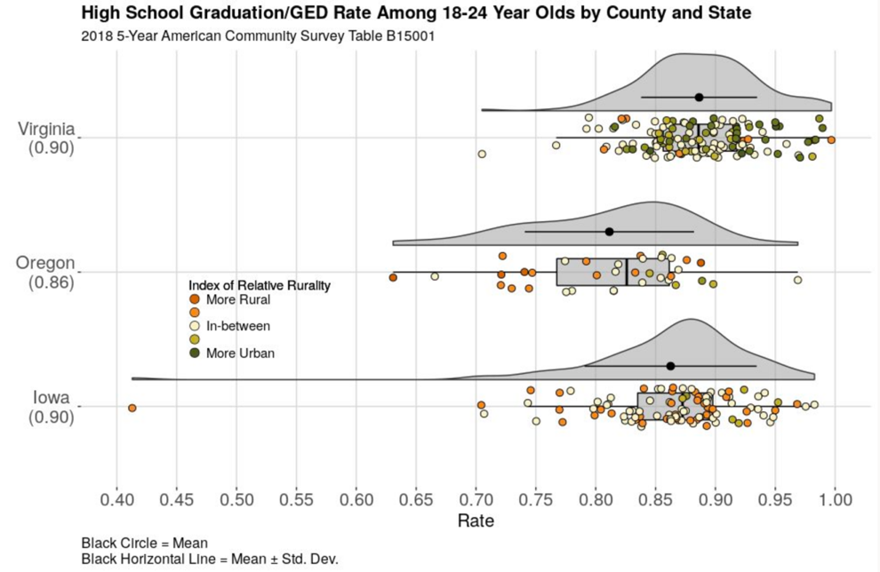
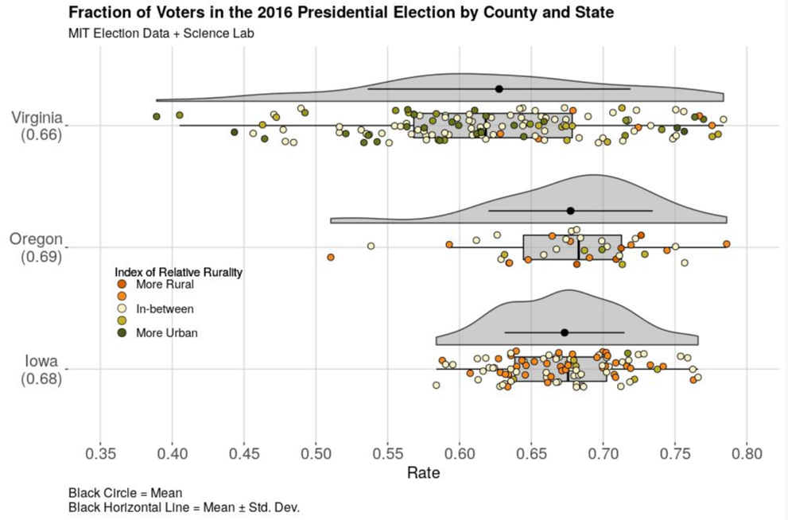

<center>
<a href = https://datascienceforthepublicgood.com/economic-mobility>

</a>
</center>

##Three-State Comparison: Virginia, Iowa, and Oregon

```{r, echo = F, message = F, warning= F}
library(knitr)
library(kableExtra)
library(dplyr)
```


This is a descriptive comparison between Iowa, Oregon, and Virginia guided by Opportunity Insights’ [Opportunity Atlas](https://opportunityatlas.org/) and their 2020 [Economic Tracker](https://tracktherecovery.org/) (Chetty et al. 2020a; Opportunity Insights Team 2020). The Opportunity Atlas uses Census data at the neighborhood level to construct an interactive mapping tool that facilitates learning from the visualization of spatial patterns (Opportunity Insights Team 2020). Their goal is to motivate research aimed at establishing the causal effects of economic mobility in support of policies that will increase opportunity. The Economic Tracker was constructed in response to COVID-19 to follow economic activity in near real-time.

Chetty et al. (2014) identified five core neighborhood characteristics that correlate with economic mobility. Neighborhoods with high economic mobility have less residential segregation and income inequality, greater social capital and family stability, and provide a great primary school education. We make our comparisons using this taxonomy and the most current data from the American Community Survey (ACS), MIT federal election data, and the IRS migration data. We present the results through data visualizations aggregated at the county level for Iowa and Oregon and at the county and independent city level for Virginia. The 38 independent cities of Virginia are classified by the Census Bureau as county equivalents. To provide additional insights, each aggregation level is identified using the 2010 Index of Relative Rurality (IRR) <span id="ref1a">[[1]](#ref1)</span>. The index uses population size, population density, extent of urbanized area, and distance to the nearest metro area, to construct a continuous measure that provides a multi-faceted measure of rurality. The IRR ranges from the most rural, 1.00, to the most urban, 0.00. The range of the rurality index for our three states is the most urban, Arlington County, VA (0.12) to the most rural, Wheeler County, OR (0.67) (see IRR Figure). To put the value of the index into perspective, the smallest rurality index in the United States is from New York County, NY (0.04) and the largest is from Northwest Arctic Borough, AK (0.89).

This comparison starts by exploring the economic and demographic differences and similarities between the three states then follows with comparisons based on the taxonomy of the five core neighborhood characteristics. Throughout current insights based on the 2020 Economic Tracker are given.

<div align="center">
{ width=75% }
</div>

### Economic Comparison

Despite the obvious geographic differences between the three states – two are coastal, one in the east the other in the west, and one in the middle – Iowa, Oregon, and Virginia provide very different avenues of opportunity for their residents. The three states have very different economies and therefore somewhat distinct avenues for economic mobility. While Iowa’s economy is often assumed to be mostly agricultural, Iowa’s most prominent industries are manufacturing, healthcare, retail, and education (Statistical Atlas 2020a). In 2010, Iowa was considered to be one of the most friendly states to do business in (CNBC 2010), but the state has seen significant declines over the past decade - driven by a depleting workforce (see Migration Figure), a “brain drain” of young college-educated residents (Carr and Kefalas 2009), and a higher cost of doing business (CNBC 2019). Today Iowa’s manufacturing sector consists mainly of processed foods from Heinz, General Mills, Quaker Oats, Tyson Foods, and ConAgra Foods. The state industrial outputs include machinery, electric equipment, chemical products, publishing, and primary metals. Traditionally Iowa also has a rich business sector, including companies that focus on finance, insurance, healthcare, and energy like wind and ethanol. This diverse economy likely explains why Iowa fared so well in most of the O[pportunity Atlas](https://www.opportunityatlas.org/) assessments from 2010 data (Chetty et al. 2014, Opportunity Insights Team 2020). Iowa children who grew up in low income households (lower quartile), had more adults living in Iowa in 2014-2015 with incomes in the higher quintile than their counterparts in Oregon and Virginia. 

Unlike Iowa, Virginia has maintained its reputation as a friendly business state over the past decade (CNBC 2019). However, when we look more closely, Virginia is really a story of two states. On the one hand, northeastern Virginia is a center of government, healthcare, finance, and tech (Statistical Atlas 2020c). Virginia has the highest defense spending of any state per capita and contains about 170,000 government jobs, including federal agencies like the National Science Foundation, Central Intelligence Agency, and Department of Defense (Maciag 2017). Northeast Virginia is also seen by many as an emerging “Silicon Valley of the East” (Gregg 2018), largely because of its proximity to Washington D.C. and major infrastructural advantages; in fact, some officials suggest that the majority of the internet runs through northern Virginia (Bacque 2019; Malecki 2002). On the other hand, southwest Virginia has historical roots in a number of declining industries, including agriculture, manufacturing, coal mining, and railroads. While Virginia has roughly 334,000 ag jobs linked to tobacco, apples, grapes, peanuts, tomatoes, turkeys and broilers (Weldon Cooper 2017), this industry has waned in recent years. Moreover, many of the major cities in Virginia, including Blacksburg, Roanoke, Lynchburg, Richmond, and Norfolk have extremely low rates of economic mobility (see [The Opportunity Atlas](https://www.opportunityatlas.org/)), as these cities have become increasingly dependent on educational institutions and the service industry for jobs. Despite the state being attractive to top businesses, Virginia is the worst state for workers’ rights  <span id="ref2a">[[2]](#ref2)</span>  – suggesting that growing income inequality is a chasm mostly affecting the Virginian working class. Employment and agricultural land use have waned over the past two decades (Rephann 2017). 

While Oregon’s economy was traditionally based on agriculture and forestry, the state has also shifted more toward manufacturing, service, and technology (Statistical Atlas 2020b). Today Oregon’s agricultural industry is predicated on blueberries, almonds, hazelnuts, wine/grapes, cattle, dairy, sheep, poultry, fishing, as well as the timber and forestry industry (Oregon AIC 2020). Despite this industry declining over the past two decades (Oregon Employment Department 2019), it does not seem that the areas with the lowest economic mobility directly coincide with the areas impacted hardest by loss of private sector jobs in timber (Opportunity Insights Team 2020). This is likely due to the state becoming more economically diverse over the past 20 years. For example, Oregon is also known for tourism (mainly in Portland), tech (i.e. Silicon Forest), healthcare (e.g. Cambia and Kaiser) as well as being home to corporate headquarters for several major clothing, steel, and manufacturing companies. Importantly, Oregon has no sales tax, has low corporate taxes, and relies mostly on personal income - making it more appealing to several high-profile businesses (Oregon.gov 2020). As a result of these factors, Oregon has seen the sixth most economic growth of all states since 2001 (Hauser and Ordonez 2019).

### Demographic Comparison

Of the three states, Virginia has the largest population, 8,535,539 and the smallest total area, 42,774.93 square miles. Virginia’s population has grown 6.7 percent from 2010; Oregon has had the largest population increase from 2010, 10.1 percent, and Iowa the smallest 3.6 percent.

```{r, echo = F}
table1 <- data.frame(State = c("Iowa", "Oregon", "Virginia"), 
                     `Population 2010`= c("3,046,871", "3,831,079", "8,001,049"), 
                     `Population 2019` = c("3,155,070", "4,217,737", "8,535,519"), 
                     `Total Area Sq. Miles` = c("56,272.81", "98,378.54", "42,774.93"))

knitr::kable(table1, caption = "TABLE 1: Population Change 2010 to 2019", 
             col.names = c("State", "Population 2010", "Population 2019", "Total Area Sq. Miles")) %>%
    kable_styling(bootstrap_options = c("striped", "hover"), full_width = F, position = "center") %>%
   footnote(general = "Census Quick Fact https://www.census.gov/quickfacts/fact/table/IA,VA,OR/RHI12521",
           general_title = "",
           footnote_as_chunk = T
           )
  

```


With regard to changes in the age distribution from 2010 to 2019, the age groups with the largest increase (65 to 74 years) and loss (45 to 54 years) are the same for the three states: Iowa +33.78 percent / -20.83 percent, Oregon +46.05 percent / -14.18 percent, and Virginia +37.68 percent / -15.23 percent (1-YR ACS Estimates Table CP05).

These changes can be summarized with the dependency ratio, the ratio of the dependent age population, young (0-17) and old (≥65), to the working age population (18 to 64). The dependency ratio captures the relation between the number of people who aren’t of working age and the number of people who are; the relation between the number of people who pay little or no taxes and the people who pay taxes. The higher the ratio, the greater the burden of support on working people and governments to support the infrastructure that serves the young and the elderly. Low dependency ratios, under appropriate conditions, could promote economic growth.  High dependency ratios may translate into increasing government expenditures towards education, healthcare, and pensions. 

The age dependency ratio can be partitioned into a child dependency ratio and an old-age dependency ratio. The trend in the U.S. since 2000 has been a decrease in the child dependency ratio and an increase in the old-age ratio, this is also seen across the three states.

```{r, echo = F}
table2 <- data.frame(State = c(rep("Iowa", 3), rep("Oregon", 3), rep("Virginia", 3), rep("United States", 3)), 
              `Dependency Ratio` = rep(c("Child", "Old-age", "Age=Child+Old-age"),4),
              `2000` = c(41.8, 24.8, 66.6, 39.6, 20.5, 60.1, 38.2, 17.4, 55.6, 41.5, 20.1, 61.6),
              `2010` = c(39.2, 24.2, 63.4, 36.1, 21.2, 57.3, 36.3, 18.3, 54.6, 38.7, 20.3, 59.0),
              `2018` = c(38.6, 27.2, 65.8, 34.3, 27.0, 61.3, 35.1, 23.1, 58.2, 36.8, 24.6, 61.4)

              )

knitr::kable(table2, caption = "TABLE 2: Age, Child, and Old-age Dependency Ratios over Time by State and United States", 
             col.names = c("State", "Dependency Ratio", "2000", "2010", "2018")) %>%
    kable_styling(bootstrap_options = c("striped", "hover"), full_width = F, position = "center") %>%
    collapse_rows(columns = 1, valign = "top") %>%
   footnote(general = "5-YR ACS 2018 Table S0101: https://data.census.gov/cedsci",
           general_title = "",
           footnote_as_chunk = T
           )
```

Box plots display both ratios by county/city where the IRR is also plotted to evaluate rurality trends. The majority of county/city old-age dependency ratios for the three states is higher than the U.S. rate (dashed horizontal line). The rate in Virginia is lower in more urban counties/cities an indication of a larger working-class population (olive filled circles). Across all three states the old-age dependency ratios in the upper quartile are located in more rural areas. The child dependency ratios are higher than the old-age ratios in all three states and indication there are more children than dependents; but where the difference was approximately two-fold in 2000 it is now less than one and a half. In Virginia the child dependency ratio is lower in more rural areas but this is does not appear to be the case in Iowa and Oregon.

<div align="center">
{ width=75% }
</div>

### Core Neighborhood Characteristics
This section explores some of the neighborhood characteristics identified in Chetty et al. (2014) that impact economic mobility: residential segregation, income inequality, social capital, family stability, and primary school education.

### Income Inequality 
To understand inequality, scholars typically account for disparities in both income and wealth. Income corresponds to the flow of resources such as income from one’s labor. In contrast, wealth refers to the stock of existing economic resources one has access to including land, capital, company shares, and inheritances (Saez 2017). While both, income and wealth, disparities have increased on the national level since the 1970s (Pew 2019; Saez and Zucman 2016), our main focus here is income inequality. Nationally, the average American’s income has increased between the median and 90th percentile of earners, but wages have stagnated for those in the bottom 50 percent (Piketty et al. 2017). While the US has the highest levels of income inequality among G7 countries, there are also a number of geographic and sociodemographic factors that contribute more strongly to existing disparities across various regions of the US (Manduca 2019; Pew 2019). 

Income inequality has increased in Iowa, Oregon, and Virginia over the past decade. From 2010 to 2018, the Gini coefficient increased 3.5 percent in Iowa (0.427 to 0.442), 3.4 percent in Oregon (0.446 to 0.461), and 2.4 percent in Virginia (0.457 to 0.468). While Iowa was still one of the six most equitable states in 2018, Virginia is ranked 23rd and Oregon is ranked 30th – neither of which have changed much from 2010. The Gini Figure shows, that most counties and cities that have a statistically significant (p-value < 0.10) change in income inequality from 2010 to 2018 are experiencing greater inequality. In Virginia, the counties with the highest levels of inequality are Dickenson (0.580), Charles City (0.545), Richmond City (0.538), Radford City (0.524), Williamsburg City (0.518) and Charlottesville City (0.517). The counties with the greatest income inequality in Iowa are Appanoose (0.513), Jefferson (0.502), Johnson (0.493), Crawford (0.488), and Emmet (0.474) and in Oregon the counties are Marion (0.431), Jackson (0.466), Grant (0.429) Jefferson (0.413), and Clackamas (0.446). 
<div align="center">

</div>

This growth in inequality is at least in part due to the resonating effects of deindustrialization, which moved rural manufacturing jobs to overseas locations – shifting most remaining jobs to the service sector and leaving millions without work altogether (Alderson 1999; Kollmeyer 2009). As a result, rural areas have experienced “brain drain” where highly-educated youth now leave to live near major metropolitan areas to work in the tech and knowledge sectors (Carr and Kefalas 2009; Moretti 2012). This geographic divergence in access to resources shapes social and political cohesion across the country, as residents see themselves as having less and less in common with each other (Beramendi 2012). Moreover, low wages have had a disproportionate impact on racial and ethnic minorities (Akee et al. 2020; Chetty et al. 2020; Manduca 2018), inhibiting historically marginalized, especially Black, communities’ capacity to accrue wealth over the course of the 20th century (Rothstein 2018: 153-176; Chetty et al. 2020; Manduca 2018).

<div align="center">
{ width=75% }

{ width=70% }
</div>

Not only does Virginia have the largest number of counties/cities moving toward greater income inequality, they are the only one of the three states with counties/cities in persistent poverty. As defined by the Congressional Research Service (CRS) <span id="ref3a">[[3]](#ref3)</span>, persistent poverty exists in “…counties that have had poverty rates of 20 percent or more for the past 30 years, as measured by the 1980, 1990, and 2000 decennial censuses.”  In 2019, the CRS updated their persistent poverty estimates using the poverty rates from the 1990 and 2000 census and the poverty rates from the Small Area Income and Poverty Estimates program. Five counties in southwestern Virginia, Buchanan, Dickenson, Lee, Montgomery, and Wise have experienced poverty rates between 20.0 and 28.7 percent since 1990. These are also counties that have seen high rates of negative migration due to a loss of jobs in the energy sector (see Migration Figure) and are projected to lose an additional 17,942 <span id="ref4a">[[4]](#ref4)</span> people through 2029. There are also seven independent cities Charlottesville, Franklin, Harrisonburg, Norton, Petersburg, Radford, and Richmond that have been in persistent poverty since 1990; in contrast, these areas are located in north and south-central Virginia. Like Virginia’s persistent poverty counties these independent cities are all experiencing high levels of out-migration.

COVID-19 is pushing income inequality even further. Since January 15th, 2020, employment rates among low wage workers in the lower quartile decreased by 10.9 percent in Iowa, 14.7 percent in Virginia, and 28.3 percent in Oregon. In contrast, employment rates among workers in the upper quartile increased by 5 percent in Iowa, and are only down 0.1 percent in Virginia and 2.1 percent in Oregon. (as of August 1st, 2020 [Economic Tracker](https://www.tracktherecovery.org/)). One of the key findings from the Opportunity Insights Economic Tracker is that the reduction in spending in the highest rent ZIP codes has led to nearly a 70 percent reduction in jobs among low wage workers compared to just a 30 percent reduction in the lowest rent ZIP codes.

### Segregation
Segregation refers to the systematic separation of people from different racial groups and socio-economic backgrounds into different neighborhoods (Glotzer 2020; Rothstein 2018; Taylor 2019). While racial segregation in the U.S. originated with Jim Crow laws implemented in the South, the practice spread to the rest of the U.S. via both local and federal policies as African Americans fled the South during the Great Migration of 1910-1970 (Galka 2016; Rothstein 2018). For example, [redlining](https://dsl.richmond.edu/panorama/redlining/#loc=5/39.1/-94.58), racially restrictive covenants, [urban renewal](https://dsl.richmond.edu/panorama/renewal/#view=0/0/1&viz=cartogram), economic disinvestment of inner cities, and [gentrification](https://www.urbandisplacement.org/map/pdx) have all impacted where communities of color have been able to live and work throughout the 20th century (Charles 2003; Glotzer 2020; Massey and Denton 1993; Rothstein 2018; Taylor 2019). More recently, highly segregated neighborhoods have led to new forms of capital investment that displace communities under the guise of gentrification, which disproportionately impacts people of color in major cities around the country (Lees et al. 2007), including [Portland, OR](https://www.urbandisplacement.org/map/pdx), [Richmond, VA](https://ncrc.org/gentrification-richmondva/), and [Des Moines, IA](https://storymaps.arcgis.com/stories/12a4f079ce494fbfabb1e77207ea0701). 

While some scholarly models do suggest that most Asian, Hispanic, and Black residents are willing to integrate into the same neighborhoods, a number of individual and structural factors reinforce the structure of racially segregated neighborhoods across the country (Charles 2003). In turn, segregation hinders economic mobility, especially for Black residents, because the most intensely segregated areas also tend to have higher levels of concentrated poverty, leading to higher rates of joblessness, out-of-wedlock births, school dropouts, crime, lower wages, and poorer health outcomes (Cutler & Glaeser 1997; Jargowsky 1996; Krivo & Peterson 1996; Massey & Denton 1993; Williams and Collins 2017; Wilson 1987). 

<div align="center">
{ width=75% }
</div>

As a result of these historical factors, most major cities in the US, including in Iowa, Oregon, and Virginia, are segregated in some form today (see Cable 2013). Iowa and Oregon have relatively similar histories in terms of racial segregation. Although slavery was never legal in either state, both Iowa and Oregon are predominantly white (91 and 87 percent White respectively) and have only seen a 2-3 percent increase in their Black populations since 1900. While racial exclusion laws were repealed over 150 years ago in Iowa and nearly 100 years ago in Oregon, redlining and restrictive covenants blocked Black occupants from inhabiting in both states throughout much of the mid-to-late-20th century (Chennault et al. 2019; Landeck 2019; Mapping Inequality 2018; Smith 2018). Over the past decade, Oregon and Iowa have become slightly more diverse; both have seen a marginal rise in the number of Hispanic and Black residents from 2010 to 2018. 

Crawford, Buena Vista and Marshall are counties with the largest shifts in the proportion of non-white population, where the large increase is predominantly explained by the Hispanic population.  For instance, the Hispanic population in Marshalltown, went from a 12.6% in 2000 up to 29.9% in 2018, Denison city from 17.4% to 48.0% and Storm Lake city from 21.0% to 37.8% in the same period. The increase in the Hispanic population is a results of jobs in the largest meat packing plants in Iowa, run by Tyson Foods in Crawford and Buena Vista, and JBS Swift in Marshall. Wheeler and Morrow counties in Oregon experienced the largest changes in proportion of White-only population. The proportion of Hispanic population in the counties increased from almost 0 to 10% and from 30 to 36%, respectively between 2010 and 2018.  Agriculture and timber industries may have attracted workers into these areas.  Finally, Virginia experienced more changes in racial composition, that is, less proportion of Whites; with the largest changes in Emporia city (-9.7%), Manassas (-9.1%), Manassas Park (-9.5%), Colonial Heights, Loudoun (-7.4%), etc. Almost all the changes in population are explained by increases in Hispanics, except in Emporia city which had predominantly more Blacks and African Americans (+7.2%) and Loudoun with more Asian population (+3.8%).

```{r, echo = F}
table3 <- data.frame(State = c("Iowa", "Oregon", "Virginia"), 
              PerHispanicorLatino10 = c(4.5, 11.2, 7.3),
              PerHispanicorLatino18 = c(5.8, 12.8, 9.2), 
              PerBlackorAfricanAmerican10 = c(2.7, 1.8, 19.5),
              PerBlackorAfricanAmerican18 = c(3.5, 1.9, 19.2)
              )

knitr::kable(table3, caption = "TABLE 3: Percentage of Black/African American and Hispanic/Latino Over Time by State", 
             col.names = c("State", "2010", "2018", "2010", "2018")) %>%
    kable_styling(bootstrap_options = c("striped", "hover"), full_width = F, position = "center") %>%
  add_header_above(c(" ", "Percentage Hispanic or Latino" = 2, "Percentage Black or African American" = 2)) %>%
  footnote(general = "5-YR ACS 2010 and 2018 Tables DP05 and B03001: https://data.census.gov/cedsci/",
           general_title = "",
           footnote_as_chunk = T
           )
```

In contrast, Virginia’s proximity to the South and its historical role in the Transatlantic Slave Trade means that the state has historically had a higher number of Black residents (Kendi 2017). While Black residents still make up about 19.2 percent of the Virginian population today, U.S. Census records indicate that there has been a ~16 percent decrease in the Black population since 1900. 

In our analyses, we looked at segregation using two indicators at the county level (see Figures), the fraction of non-Hispanic white residents and fraction of residents who commute more than 15 minutes. The figures show that Virginia is dramatically different than the other two states. Only a few counties in Iowa and Oregon have rates of non-Hispanic white residents below 0.75. This means, on average,  residents in these states are very unlikely to come in contact with other racial or ethnic groups. In contrast, Virginians are much less segregated. When we examined travel times, we see that Virginians typically have longer commute times than Iowans and Oregonians. While Iowa and Oregon are more rural, which could theoretically translate to traveling farther to go to work, only about half of residents travel more than 15 minutes to work. As results from our other dashboards show, Iowans with longer commutes tend to be clustered around the suburbs of Waterloo, Cedar Rapids, Iowa City, and Des Moines.

<div align="center">
{ width=75% }
</div>

As mentioned previously, the Opportunity Insights [Economic Tracker](https://www.tracktherecovery.org/) established that high rent ZIP codes have had the highest percentage of low-income job losses (Opportunity Insights 2020). COVID-19 has made evident another consequence of income segregation - high rent ZIP codes have the high-income workers who are more likely to have jobs along with internet access that allow them to work from home. They may also have the income to have food and other necessities delivered, thus avoid the local business establishments that employ retail and service workers. 

### Family Structure

Family structure has long been a focal point of economic and sociological literature. Despite most Americans not thinking that family structure matters in today’s society (Thomas 2020), the combination of single-parent households, declining marriage rates, and rising divorce rates have recently been shown to thwart upward economic mobility (Chetty et al. 2014) and to increase downward mobility (Bloome 2017). Conceptually, family structure is complicated to measure and interpret, as families with different economic, racial, or cultural backgrounds have increasingly deviated from the nuclear structure that was prevalent in the U.S. for much of the 20th century (Cancian and Haskins 2014; Pew Research 2020). Today, single-parent households are more common because of high, albeit declining (Kennedy and Ruggles 2014), marriage and divorce rates (U.S. Census 2020), millennial parents being more willing to raise children out of wedlock (Barroso et al. 2020), and due to an increase in cohabitation – when partners live together without being married (Manning 2015). While these trends are general indicators that women have gained more autonomy in the marketplace, the lack of a joint-income and caretaker support can thwart economic opportunities and hinder the accumulation of wealth, leading to worse long-term outcomes for children and their parents (Amato 2000; Chetty et al. 2014; Hao 1996). These obstacles disproportionately effect different groups throughout the U.S. (e.g. Bloome 2014). Generally, Black families are much less likely to marry than other racial or ethnic groups (Barroso et al. 2020) but are also more likely to be negatively impacted by mass incarceration (Chung and Hepburn 2018; Western and Wildeman 2009) as well as the death of an immediately family member (Umberson et al. 2017). Immigration can also play a significant role in shaping family structure (Glick 2010), including due to the threat of deportation and precarious work conditions. Moreover, same-sex marriage was not legal prior to 2015, meaning that LGBTQ communities were not afforded the same legal and economic advantages as heterosexual families. Finally, those with less than a high school education are most likely to live in a single-parent household (Barroso et al. 2020). 

<div align="center">
{ width=75% }
</div>

When looking at the comparisons between the three states, we see that Iowa has a slightly lower rate of children growing up in single-parent households. While Oregon and Virginia have similar averages on this outcome, Virginia has a much wider range with several counties having a majority of children growing up in single-parent households. Today, Virginia and Oregon have slightly higher marriage rates than Iowa - all of which come close to the national average (US Census Bureau 2020). On the other hand, Oregon has a much higher divorce rate than Iowa or Virginia, largely because the latter two states have seen significant declines in divorce rates over the past decades (US Census Bureau 2020). 

### K-12 School Systems
Chetty et al. (2014) also found that K-12 school systems, as measured using high school graduation rates and standardized test scores, influences economic mobility. In general, sociological and economic literature show that high-income parents are more likely than low-income students to raise highly educated children and that more highly-educated children tend to earn more income as adults (see Lareau 2011). Unfortunately, the disparity between these groups have become increasingly more inequitable in recent decades (Belley and Lochner 2007; Bloome et al. 2018; Ziol-Guest and Lee 2016). Yet, these patterns don’t just emerge at the individual level; they are embedded in broader social structures that re-produce inequality based on racial or economic background. Past work has found low income as well as Black and Hispanic students do worse on ACT and SAT tests relative to White and Asian students, but these studies suggest that standardized test scores are also less predictive for these groups (Mattern et al. 2016; Perry 2019). While similar inequities exist for high school graduation rates based on race and social class, these disparities have been declining over the past 15 years, especially for Black students (Geiger 2018; Ziol-Guest and Lee 2016). Past work has found low income as well as Black and Hispanic students do worse on ACT and SAT tests relative to  and Asian students, but these studies suggest that standardized test scores are also less predictive for these groups (Mattern et al. 2016; Perry 2019). While similar inequities exist for high school graduation rates based on race and social class, these disparities have been declining over the past 15 years, especially for Black students (Pew 2018). 

<div align="center">
{ width=75% }
</div>

When we look at high school graduation rates across the three states, we see that Virginia has the highest totals followed closely by Iowa and more distantly by Oregon. Here, it seems that highly rural areas are more likely to pull the mean graduation rate down in Iowa and Oregon, suggesting that students in those areas may not see the value in finishing high school or getting a college degree. When comparing states on ACT test scores, Virginia (ranked 11th) is also markedly higher than Iowa (ranked 22nd) and Oregon (ranked 26th) (Kapelke-Dale 2020). On the other hand, Iowa ranks much higher (3rd) than Oregon (25th) or Virginia (27th) on SAT scores (World Population Review 2020). While the other factors generally align with economic mobility outcomes at the state level, trends in K-12 education seem to have changed quite a bit since 2010. 

When we look at high school graduation rates across the three states, we see that Virginia has the highest totals followed closely by Iowa and more distantly by Oregon. Here, it seems that highly rural areas are more likely to pull the mean graduation rate down in Iowa and Oregon, suggesting that students in those areas may not see the value in finishing high school or getting a college degree. When comparing states on ACT test scores, Virginia (ranked 11th) is also markedly higher than Iowa (ranked 22nd) and Oregon (ranked 26th) (Kapelke-Dale 2020). On the other hand, Iowa ranks much higher (3rd) than Oregon (25th) or Virginia (27th) on SAT scores (World Population Review 2020). While the other factors generally align with economic mobility outcomes at the state level, trends in K-12 education seem to have changed quite a bit since 2010. 

According to Opportunity Insights’ [Economic Tracker](https://www.tracktherecovery.org/) (Chetty et al. 2020), trends in total student progress in online math coursework are very different between the three states: 72 percent of the counties in Oregon use the curriculum, 52% in Iowa, and only 11 percent in Virginia. Unfortunately, any inferences are confounded by the fact data are limited to schools that use the hands-on instructional and digital learning curriculum from the nonprofit institution Zearn. In Oregon, the progress for all income levels is positive with an overall progress of 40.6 percent and even higher progress for low income students, 50.1 percent. For Iowa there is no progress in any income group, the total progress in online math coursework decreased by 47.9 percent.

### Social Capital

Social capital refers to how effective social groups function as a result of their shared sense of identity, group norms, values, trust, and cooperation. Social capital often includes both tangible (e.g. access to shared space, private property) and intangible (e.g. people, shared beliefs) assets that communities share to engage in collective action. One way to think about social capital is the number of other community members one is linked to in their social network (e.g. Borgatti et al. 1998). Alternatively, Putnam (2000) conceptualizes social capital as engagement social intercourse such as voting, serving on local committees, and working with political parties.  

<div align="center">
{ width=75% }
</div>

While there are longstanding debates about the best ways to measure social capital (Grootaert and Bastelar 2002), Chetty et al. (2014) used a social capital index and religious affiliation to explore social capital in communities. Here, we use voter participation rates in the 2016 election. While participation in elections decreased by several points from the 2008 presidential election in Iowa (70.2 percent), Oregon (67.6 percent), and Virginia (68.7 percent), each state still had higher than average voter turnout in the 2016 presidential election with 63.4 percent of Iowans, 66.3 percent for Oregonians, and 68.2 percent for Virginians heading to the polls. As the figure shows, the range of voter turnout is much wider in Virginia than in Oregon and Iowa. Previous work has also shown that Iowa has more civic engagement on other outcomes as well. When analyzing various county level outcomes for social capital, Rupasingha and Goetz (2006) show that Iowa has the highest number of organizations per 1000 people (1.92) with Virginia (1.43) and Oregon (1.24) much lower on the list. Additionally, Iowa’s 2010 Census response rate (0.78) was higher than both Virginia (0.77) and Oregon (0.72). These differences may be shaped by a number of factors, including Iowa’s prominent position as an early caucus and perpetual swing state or that rural areas have generally done better in cultivating shared social capital among those that remain in the state. However, this may also be explained, at least in part, by the fact that Iowa has more older voters who tend to turn out at higher rates than younger people (File 2014). 


### Footnotes 

<div id = "ref1">[[1]](#ref1a) Waldorf, Brigitte, and Ayoung Kim. 2015. "Defining and Measuring Rurality in the US: From Typologies to Continuous Indices." Commissioned paper prepared for the National Academies of Sciences Workshop on Rationalizing Rural Classifications, April 2015, Washington, D.C. https://sites.nationalacademies.org/cs/groups/dbassesite/documents/webpage/dbasse_168031.pdf.
</div>

<div id = "ref2">[[2]](#ref2a) OXFAM The Best States to Work Index: A Guide to Labor Policies in the United States (2019) https://s3.amazonaws.com/oxfam-us/www/static/media/files/Best_States_to_Work_Index.pdf </div>

<div id = "ref3">[[3]](#ref3a) Congressional Research Service Report on The 10-20-30 Provision: Defining Persistent Poverty Counties (2019) https://fas.org/sgp/crs/misc/R45100.pdf
</div>

<div id = "ref4">[[4]](#ref4a) Virginia Growth and Opportunity Region One Growth and Diversification Plan (August 2019) https://govirginia.org/regions/one/
</div>

### References 

Akee, R., Jones, M. R., & Porter, S. R. (2019). Race matters: Income shares, income inequality, and income mobility for all US races. Demography, 56(3), 999-1021.

Alderson, A. S. (1999). Explaining deindustrialization: Globalization, failure, or success? American Sociological Review, 701-721. 

Bacque, P. (2019). Virginia power certifies West Creek as potential data center cite. Richmond Times-Dispatch. https://richmond.com/business/economy/va-power-certifies-west-creek-as-potential-data-center-site/article_f2d98326-32c9-52d1-8ecc-2f3416de0542.html 

Barroso, A., Parker, K., & Bennett, J. (2020). As Millennials Near 40, They’re Nearly Approaching Family Life Differently Than Previous Generations. Pew Research Center. https://www.pewsocialtrends.org/2020/05/27/as-millennials-near-40-theyre-approaching-family-life-differently-than-previous-generations/ 

Belley, P., & Lochner, L. (2007). The changing role of family income and ability in determining educational achievement. Journal of Human Capital, 1(1), 37-89. 

Beramendi, P. (2012). The Political Geography of Inequality: Regions and Redistribution. Cambridge University Press: Cambridge, UK. 

Bloome, D. (2014). Racial inequality trends and the intergenerational persistence of income and family structure. American Sociological Review, 79(6), 1196-1225.

Bloome, D. (2017). Childhood family structure and intergenerational income mobility in the United States. Demography, 54(2), 541-569. 

Bloome, D., Dyer, S., & Zhou, X. (2018). Educational inequality, educational expansion, and intergenerational income persistence in the United States. American Sociological Review, 83(6), 1215-1253. 

Borgatti, S. P., Jones, C., & Everett, M. G. (1998). Network measures of social capital. Connections, 21(2), 27-36.

Cable, D. (2013). The Racial Dot Map. University of Virginia Demographics Research Group. https://demographics.coopercenter.org/racial-dot-map

Cancian, M., & Haskins, R. (2014). Changes in family composition: Implications for income, poverty, and public policy. The ANNALS of the American Academy of Political and Social Science, 654(1), 31-47. 

Carr, P. J., & Kefalas, M. J. (2009). Hollowing Out the Middle: The Rural Brain Drain and What it Means for America. Beacon Press: Boston, MA.

Charles, C. Z. (2003). The dynamics of racial residential segregation. Annual Review of Sociology, 29(1), 167-207.

Chennault, C., Klavitter, L., & Sutton, L. (2019). Visceral Encounters: A Political Ecology of Urban Land, Food, and Housing in Dubuque, Iowa. Social Sciences, 8(4), 122.

Chetty, R., Hendren, N., Jones, M. R., & Porter, S. R. (2020a). Race and economic opportunity in the United States: An intergenerational perspective. The Quarterly Journal of Economics, 135(2), 711-783. 

Chetty, R., Friedman, J., Hendren, N., Stener, M., and Opportunity Insights Team. (2020b). Opportunity Insights Economic Tracker. https://tracktherecovery.org/

Chetty, R., Hendren, N., Kline, P., & Saez, E. (2014). Where is the land of opportunity? The geography of intergenerational mobility in the United States. The Quarterly Journal of Economics, 129(4), 1553-1623.

Chung, P. H., & Hepburn, P. (2018). Mass imprisonment and the extended family. Sociological Science, 5, 335-360.

CNBC. (2010). America’s Top States for Business – A CNBC Special Report: Overall Rankings – 2010. https://web.archive.org/web/20111226183123/http:/www.cnbc.com/id/37516043 

CNBC. (2019). America’s Top States for Business in 2019. https://www.cnbc.com/2019/07/10/americas-top-states-for-business-2019.html 

Cutler, D. M., & Glaeser, E. L. (1997). Are ghettos good or bad? The Quarterly Journal of Economics, 112(3), 827-872. 

File, R. (2014). Young-Adult Coting: An Analysis of Presidential Elections, 1964-2012. Current
Population Survey Reports, P20-572. United States Census Bureau. Washington, DC.

Galka, M. (2016). Visualizing the Great Migration – The Most Under-Reported Story of the 20th Century. Metrocosm. http://metrocosm.com/great-migration-visualization/ 

Geiger, A. (2018). 6 facts about America’s students. Pew Research Center. https://www.pewresearch.org/fact-tank/2018/09/07/6-facts-about-americas-students/ 

Glick, J. E. (2010). Connecting complex processes: A decade of research on immigrant families. Journal of Marriage and Family, 72(3), 498-515.

Glotzer, P. (2020). How the Suburbs Were Segregated: Developers and the Business of Exclusionary Housing, 1890–1960. Columbia University Press: New York, NY. 

Gregg, A. (2018). Silicon Valley Alternative. The Washington Post. https://www.washingtonpost.com/news/business/wp/2018/06/22/feature/forget-silicon-valley-the-dulles-tech-corridor-is-cultivating-companies-that-break-the-mold/

Grootaert, C., & Van Bastelar, T. (Eds.). (2002). Understanding and Measuring Social Capital: A Multi-Disciplinary Tool for Practitioners. The World Bank.

Hauser, D. & Ordonez, J. Oregon enjoys strong economic growth. Oregon Center for Public Policy. https://www.ocpp.org/2019/04/18/SWO-strong-economic-growth/ 

Hao, L. (1996). Family structure, private transfers, and the economic well-being of families with children. Social Forces, 75(1), 269-292.

Jargowsky, P. A. (1996). Take the money and run: Economic segregation in US metropolitan areas. American Sociological Review, 984-998.

Kapelke-Dale, R. (2020). Average ACT Scores by State – 2020 Update. Magoosh. https://magoosh.com/hs/act/act-scores/2020/average-act-scores-by-state/ 

Kendi, I. X. (2017). Stamped from the Beginning: The Definitive History of Racist Ideas in America. Random House: New York, NY.

Kollmeyer, C. (2009). Explaining deindustrialization: How affluence, productivity growth, and globalization diminish manufacturing employment. American Journal of Sociology, 114(6), 1644-1674.

Krivo, L. J., & Peterson, R. D. (1996). Extremely disadvantaged neighborhoods and urban crime. Social Forces, 75(2), 619-648.

Landeck, K. (2019). The Legacy of Redlining and Segregation on Des Moines, Iowa. Doctoral Dissertation, Iowa State University. https://lib.dr.iastate.edu/cgi/viewcontent.cgi?article=1347&context=creativecomponents 

Lareau, A. (2011). Unequal Childhoods: Class, Race, and Family Life. University of California Press: Berkeley, CA.

Lees, L., Slater, T., & Wyly, E. (2013). Gentrification. Routledge: Philadelphia, PA. 

Maciag, M. (2017). Federal Employees By State. Governing: The Future of States and Localities. https://www.governing.com/gov-data/federal-employees-workforce-numbers-by-state.html

Malecki, E. J. (2002). The economic geography of the Internet’s infrastructure. Economic geography, 78(4), 399-424.

Manduca, R. (2018). Income inequality and the persistence of racial economic disparities. Sociological Science, 5, 182.

Manduca, R. A. (2019). The contribution of national income inequality to regional economic divergence. Social Forces, 98(2), 622-648.

Manning, W. D. (2015). Cohabitation and child wellbeing. The Future of Children/Center for the Future of Children, the David and Lucile Packard Foundation, 25(2), 51.

Massey, D., & Denton, N. A. (1993). American Apartheid: Segregation and the Making of the Underclass. Harvard University Press: Cambridge, MA. 

Mattern, K., Radunzel, J., & Harmstron, M. (2016). ACT Composite Score by Family Income. ACT Research & Policy. 

Moretti, E. (2012). The New Geography of Jobs. Houghton Mifflin Harcourt: Boston, MA. 

Nelson, R., Madron, J., Ayers, N., et al. (2020). Mapping Inequality: Redlining in the New Deal America. University of Richmond’s Digital Scholarship Lab. https://dsl.richmond.edu/panorama/redlining/

Opportunity Insights Team. (2020). The Opportunity Atlas. https://www.opportunityatlas.org/ 

Oregon.gov. (2020). Sales Tax. Oregon Department of Revenue. https://www.oregon.gov/dor/pages/sales-tax.aspx

Oregon Agriculture in the Classroom Foundation. (2020). Grown in Oregon. Oregon Agriculture in the Classroom Foundation. https://oregonaitc.org/resources/oregon-resources/oregon-map/ 
 
Perry, A. (2019). Students need more than an SAT adversity score, they need a boost in wealth. Brookings Institute. https://www.brookings.edu/blog/the-avenue/2019/05/17/students-need-more-than-an-sat-adversity-score-they-need-a-boost-in-wealth/ 

Piketty, T., Saez, E., & Zucman, G. (2018). Distributional national accounts: methods and estimates for the United States. The Quarterly Journal of Economics, 133(2), 553-609.

Putnam, R. D. (2000). Bowling Alone: The Collapse and Revival of American Community. Simon and Schuster: New York, NY.

Rephann, R. (2017). The Economic Impact of Virginia’s Agriculture and Forest Industries. Weldon Cooper Center for Public Service. University of Virginia. https://ceps.coopercenter.org/publications/economic-impact-virginias-agriculture-and-forest-industries 

Rooney, B. (2019). Oregon’s Forestry and Logging Industry: From Planting to Harvest. State of Oregon Employment Department. https://www.qualityinfo.org/-/oregon-s-forestry-and-logging-industry-from-planting-to-harvest

Rothstein, R. (2017). The Color of Law: A Forgotten History of How Our Government Segregated America. Liveright Publishing: New York, NY.

Rupasingha, A., Goetz, S. J., & Freshwater, D. (2006). The production of social capital in US counties. The Journal of Socio-Economics, 35(1), 83-101.

Saez, E. (2017). Income and wealth inequality: Evidence and policy implications. Contemporary Economic Policy, 35(1), 7-25.

Schaeffer, K. (2020). 6 facts about economic inequality in the U.S. Pew Research Center. https://www.pewresearch.org/fact-tank/2020/02/07/6-facts-about-economic-inequality-in-the-u-s/ 

Smith, G. (2018). “Congenial Neighbors”: Restrictive Covenants and Residential Segregation in Portland, Oregon. Oregon Historical Quarterly, 119(3), 358-364.

Statistical Atlas. (2020a). Industries in Iowa. Statistical Atlas. https://statisticalatlas.com/state/Iowa/Industries 

Statistical Atlas. (2020b). Industries in Oregon. Statistical Atlas. https://statisticalatlas.com/state/Oregon/Industries 

Statistical Atlas. (2020c). Industries in Virginia. Statistical Atlas. https://statisticalatlas.com/state/Virginia/Industries

Taylor, K. Y. (2019). Race for Profit: How Banks and the Real Estate Industry Undermined Black Homeownership. UNC Press Books. 

Thomas, D. (2020). As family structures change in U.S., a growing share of Americans say it makes no difference. Pew Research Center. https://www.pewresearch.org/fact-tank/2020/04/10/as-family-structures-change-in-u-s-a-growing-share-of-americans-say-it-makes-no-difference/ 

Umberson, D., Olson, J. S., Crosnoe, R., Liu, H., Pudrovska, T., & Donnelly, R. (2017). Death of family members as an overlooked source of racial disadvantage in the United States. Proceedings of the National Academy of Sciences, 114(5), 915-920.

U.S. Census Bureau. (2020). U.S. Marriage and Divorce Rates by State. U.S. Census Bureau. https://www.census.gov/library/visualizations/interactive/marriage-divorce-rates-by-state.html 

Western, B., & Wildeman, C. (2009). The Black family and mass incarceration. The ANNALS of the American Academy of Political and Social Science, 621(1), 221-242.

Wilson, W. J. (1987). The Truly Disadvantaged: The Inner City, the Underclass, and Public Policy. University of Chicago Press: Chicago, IL.

Williams, D. R., & Collins, C. (2017). Racial residential segregation: A fundamental cause of racial disparities in health. Public Health Reports.

World Population Review. (2020). SAT Scores by State 2020. World Population Review. https://worldpopulationreview.com/state-rankings/sat-scores-by-state 

Ziol-Guest, K. M., & Lee, K. T. (2016). Parent income–based gaps in schooling: Cross-cohort trends in the NLSYs and the PSID. AERA Open, 2(2). 


